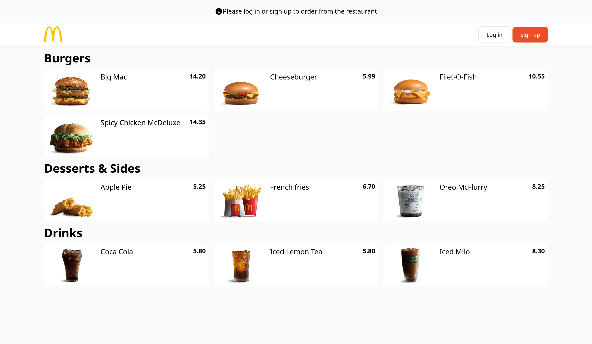
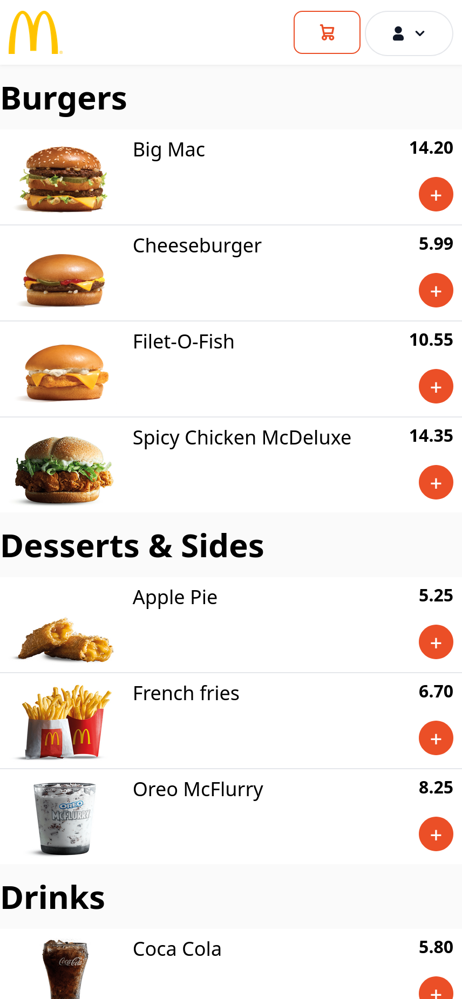
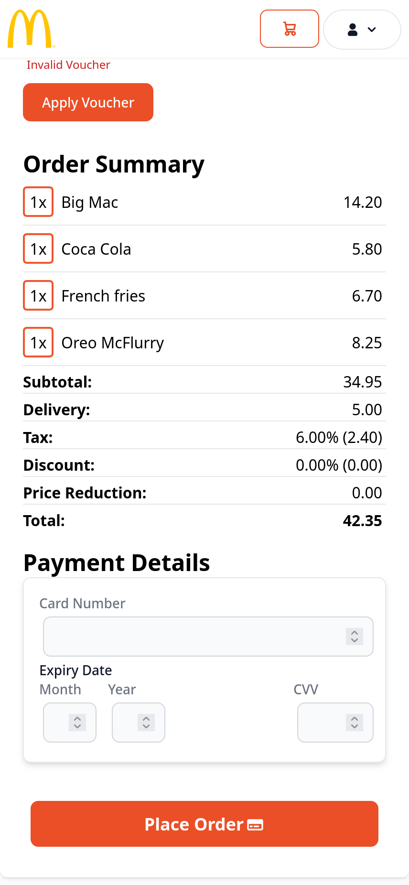
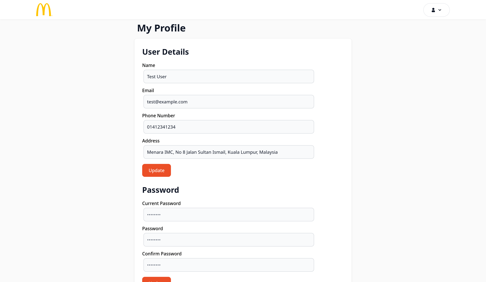

# order-system 
A simple online ordering system for a restaurant developed by [@mskobun](https://github.com/mskobun) and [@vernonlim](https://github.com/vernonlim) for 
COMP1044 Databases and Interfaces at University of Nottingham Malaysia.

It uses PHP with Laravel framework for the backend, Svelte with flowbite for the frontend, and intertia.js to 
pass data between the two.

## Installation instructions for examiners

1. Make sure `php`, `composer` and NodeJS + `npm` are installed.
2. Change to project directory.
3. Run `composer install` to install PHP packages.
4. Run `npm install` to install NodeJS packages.
5. Copy `.env.example` to `.env`
6. Change database settings in `.env` to match your setup. Uncomment lines if necessary.
7. Run `npm run build` to build the frontend.
8. Run `php artisan optimize`.
9. Set up your HTTP server to point to "<project directory>/public" as document root.
10. If using Apache, ensure `mod_rewrite` is enabled.

## Running a development setup

1. Set up DB settings in .env
2. Run `php artisan db:migrate` and then `php artisan db:seed` to migrate and seed the database respectively.
2. Run `npm run dev` to build Svelte files with live reload
2. Run `php artisan serve` to run the Laravel development server.
